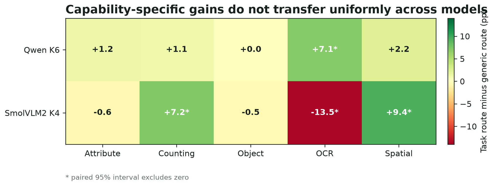

# Searching for Task-Specific Vision Paths

**Evolutionary block pruning across Qwen2.5-VL and SmolVLM2**

This repository studies a narrow question: when a VLM vision encoder must skip the same number of
transformer blocks, can combinatorial search find better routes than independent, contiguous, or
random pruning, and do named visual capabilities benefit from different routes?

## Result in One Paragraph

Evolutionary search consistently finds better block combinations than naive route construction
across two architectures. Task-specific routing is not universally better. On Qwen K6, the evolved
task policy is +2.17 percentage points over evolved generic `[0.00, 4.34]`, driven by OCR. On
SmolVLM2 K4, task routing is only +0.80 points overall `[-1.94, 3.54]`: counting and spatial improve,
while OCR falls. On a sealed 250-example IIIT5K transfer set, the Smol OCR-specific route is 13.6
points worse than generic K4. The defensible conclusion is that **route search generalizes, but a
universal capability-to-layer map does not**.



## Main Results

| Model | Budget | Full | Evolved generic | Evolved task | Task - generic | Paired 95% CI |
|---|---:|---:|---:|---:|---:|---:|
| Qwen2.5-VL-3B | K4 | 83.68 | 81.28 | 81.39 | +0.11 pp | [-1.83, 2.05] |
| Qwen2.5-VL-3B | K6 | 83.68 | 79.11 | 81.28 | +2.17 pp | [0.00, 4.34] |
| Qwen2.5-VL-3B | K8 | 83.68 | 75.91 | 76.60 | +0.68 pp | [-1.71, 3.08] |
| SmolVLM2-2.2B | K4 | 82.65 | 72.49 | 73.29 | +0.80 pp | [-1.94, 3.54] |

SmolVLM2 K4 evolved generic beats generic independent by +4.91 points `[1.83, 7.99]`; evolved task
beats task-independent by +8.90 points `[5.82, 11.99]`. Its generic route removes 14.76% of vision
parameters (2.71% of the full model) and measures +8.60% vision / +4.19% end-to-end speedup. The
latency result is an unlocked same-VM RTX 4090 comparison, not an edge-device claim.

## Reproduce the Paper Assets

No GPU or model download is required. The command reads committed aggregate JSON and regenerates
all paper figures in PNG/PDF/SVG, tables in CSV/Markdown/LaTeX, the website assets, and a checked
paper data manifest.

```bash
python3 -m venv .paper-venv
.paper-venv/bin/pip install -r requirements-paper.txt
make PYTHON=.paper-venv/bin/python submission
```

## Repository Map

```text
paper/                      Manuscript outline, writing prompts, references, figures and tables
site/                       Responsive static research website ready to mirror in Wix
results/                    Committed aggregate evidence and historical experiment reports
configs/                    Frozen model, dataset, search and evaluation configurations
data/*/manifests/           Reproducible metadata and hashes; dataset images are not committed
scripts/                    Dataset, inference, analysis, search and paper-generation commands
src/vlm_bench/              Dataset, scoring and VLM evaluation implementation
tests/                      CPU unit tests
docs/                       Dataset card and frozen experimental protocols
decision-log/               Commit-level research and engineering decisions
```

Start with the [paper package](paper/README.md), [final conclusions](results/cross-model-replication-k4/CONCLUSIONS.md),
and [research website](site/index.html).

## Experimental Design

- **Models:** Qwen2.5-VL-3B-Instruct (32 vision blocks) and SmolVLM2-2.2B-Instruct (27 blocks).
- **Intervention:** replace a selected set of vision-transformer blocks with identity; no fine-tuning.
- **Capabilities:** attribute/color, counting, object existence, OCR, and spatial relations.
- **Discovery data:** 1,780 examples and 1,431 unique images from MME, OCRBench, TallyQA, VSR,
  POPE, and VQAv2 Color.
- **Method-selection data:** 876 image-disjoint examples with source-aware objectives.
- **Controls:** independent rankings, contiguous removal, three random routes, evolved generic,
  and evolved capability routes, always compared at the same K.
- **Uncertainty:** paired bootstrap 95% intervals over the same examples.
- **Transfer:** consumed external Qwen suite plus a post-freeze 250-example IIIT5K Smol OCR audit.

Exact model revisions:

- Qwen: `66285546d2b821cf421d4f5eb2576359d3770cd3`
- SmolVLM2: `482adb537c021c86670beed01cd58990d01e72e4`

## Evidence Boundary

Processed-v2 development/test partitions are image-disjoint method-development and method-selection
evidence, not a new sealed benchmark. SmolVLM2 has a completed K4 replication only; its stopped K6
run is diagnostic. A consistent latency audit of the final evolved Qwen K4/K6/K8 routes was not
collected, so this repository does not claim a complete accuracy-latency Pareto curve. Identity
skipping reduces executed vision depth but does not by itself create a smaller serialized checkpoint.

## Core Documentation

- [Paper claim and limitations](paper/claims-and-limitations.md)
- [Manuscript outline](paper/outline.md)
- [Section-by-section writing guide](paper/writing-guide.md)
- [Related work map and BibTeX](paper/related-work.md)
- [Submission checklist](paper/submission-checklist.md)
- [Dataset card](docs/dataset_card.md)
- [Robust route-search protocol](docs/robust_route_search_protocol.md)
- [Final cross-model report](results/cross-model-replication-k4/README.md)
- [Qwen matched-K analysis](results/robust-route-search-qwen25-vl-3b/analysis/README.md)
- [SmolVLM2 K4 analysis](results/robust-route-search-smolvlm2-2b-k4/analysis/README.md)

## Historical Pipeline

The full GPU pipeline remains available for audit and extension. See `requirements-gpu.txt`, frozen
configs, and the protocol documents. Raw predictions, dataset images, model snapshots, and caches
are intentionally excluded from Git; compact summaries, routes, hashes, and paired analyses are
committed. The final paper package does not require rerunning inference.
